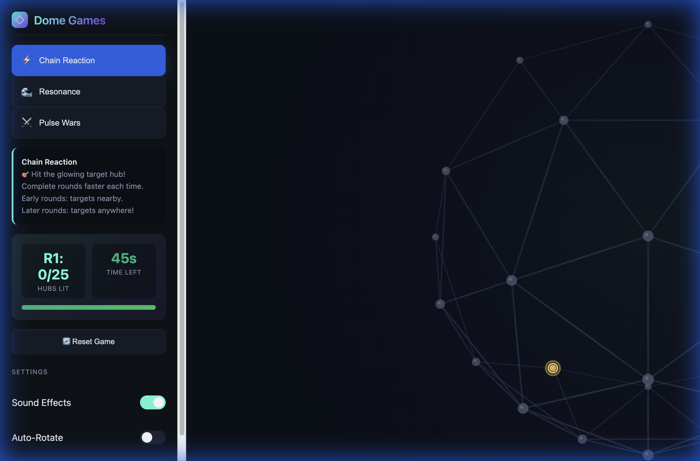

# Geodesic Dome OS v2.0

A modular interactive geodesic dome visualization, game engine, and hardware controller.



## Overview

This project simulates a 2V Geodesic Dome with LED-lit hubs. It is designed to act as the **Control System** for a physical 5-meter dome installation, sending data via WebSerial/RS485 to embedded controllers.

## Features

- **Interactive 3D Simulation**: Drag, zoom, and interact with the dome on screen.
- **Modular Game Engine**: Flexible architecture to add new light games easily.
- **Hardware Integration**: Built-in WebSerial driver to control physical LED hubs via RS485.
- **Premium Dashboard**: A dark-mode, touch-friendly interface for field operators.

### Game Modes

- **⚡ Chain Reaction**: Hit glowing targets to light up hubs and maintain combos.
- **🌊 Resonance**: Create waves of color that flow across the dome surface.
- **⚔️ Pulse Wars**: A competitive territory control game (Red vs Blue).

## Technical Architecture

The project is structured as a modular ES6 application:

```
/
├── index.html          # Entry point and UI layout
├── css/
│   └── styles.css      # Premium UI styles
└── js/
    ├── main.js         # Application bootstrapper
    ├── dome.js         # Geometry generation and state
    ├── renderer.js     # HTML5 Canvas 3D visualization
    ├── game_engine.js  # Main loop and logic
    ├── games/          # Individual game logic modules
    └── hardware/
        ├── led_interface.js  # Abstract base class
        └── serial_leds.js    # WebSerial RS485 implementation
```

## Physical Dome Setup

### Hardware Requirements
- **Hubs**: Custom LED hubs (e.g., ESP32 or RS485-addr nodes).
- **Communication**: USB-to-RS485 adapter connected to the host computer.
- **Topology**: Daemon chain or star topology depending on RS485 termination.

### WebSerial Protocol
The `SerialLEDs` module sends binary frames to the RS485 bus.
**Default Config**: `115200 baud, 8N1`

#### Frame Structure (Draft)
A simple frame is sent every update loop (60Hz or limited):
`[START(0xAA), R1, G1, B1, R2, G2, B2, ..., END(0x55)]`

To modify the protocol, edit `js/hardware/serial_leds.js`.

## Getting Started

1. **Serve the directory**: Due to ES6 Modules, you must run a local HTTP server.
   ```bash
   python3 -m http.server 8000
   ```
2. **Open the App**: Navigate to `http://localhost:8000`.
3. **Connect Hardware**:
   - Plug in your USB-RS485 adapter.
   - Click **CONNECT RS485** on the dashboard.
   - Select your device from the browser popup.

## Automation & Testing

A global helper `window.GeodesicHelper` is available in the browser console for automation and debugging:

- `switchGame(gameId)`: Switches the active game (e.g., `'pulsewars'`, `'chain'`).
- `triggerNode(nodeId)`: Simulates a physical interaction (button press) on a specific dome node.
- `getGameState()`: Returns current game metadata (active state, levels, scores).
- `getNodeScreenPositions()`: Returns screen coordinates and interaction properties (`isTarget`, `capturedBy`) for all nodes.

**Example (Console):**
```javascript
GeodesicHelper.switchGame('pulsewars');
const targets = GeodesicHelper.getNodeScreenPositions().filter(n => n.isTarget);
GeodesicHelper.triggerNode(targets[0].id);
```
